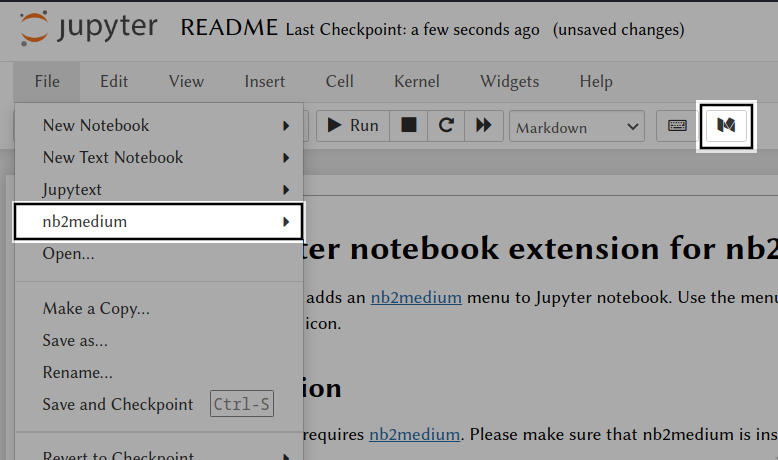

# A Jupyter notebook extension for nb2medium

This extension adds an [nb2medium](https://github.com/lucharo/nb2medium/blob/master/README.md) menu to Jupyter notebook. Use the menu to upload your notebook as a Medium draft. Alternatively you can use a button on the tool bar with an M icon.



## Installation

The extension requires [nb2medium](https://github.com/lucharo/nb2medium/blob/master/README.md). Please make sure that nb2medium is installed on your system. 

Installing nb2medium **does not** activate the nb2medium menu and button by default. If you want to install and activate it manually, use the following commands:

```bash
jupyter nbextension install --py nb2medium
jupyter nbextension enable --py n2bmedium
```

Add `--user` to these commands if you want to activate the extension only for the current user.\
Add `--sys-prefix` to these commands if you want to activate the extension only in current virtual environment.

## How to develop this extension

If you wish to develop this extension, install the javascript file locally with:

```bash
cd nb2medium/nbextension
jupyter nbextension install nb2medium.js --symlink --user
jupyter nbextension enable nb2medium --user
```

Then, make the desired changes to `index.js` and reload the extension by simply refreshing the notebook (Ctrl+R or F5). In case your OS does not allow symlinks, edit the copy of `index.js` that is actually used by Jupyter (refer to the output of `jupyter nbextension install --user nb2medium.js`).
