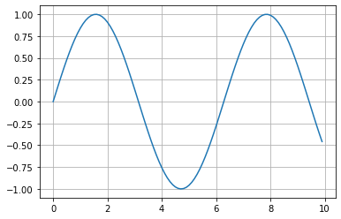
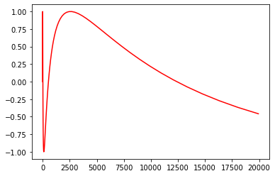
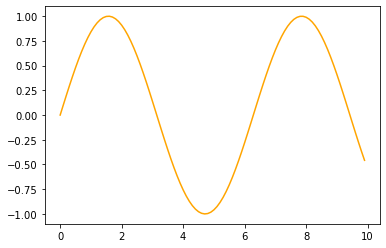
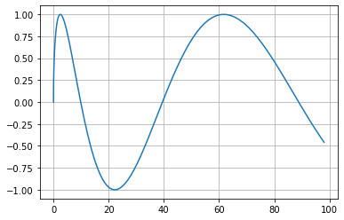

# Complete Test of `nb2medium`

## My empty and sad subtitle

We will use this notebook as a complete example of the `nb2medium` capabilities

### "Normal" cells

Assign a value


```python
a = 1
```

Have a value returned (JNB's default), note that printed and returned values are different


```python
a
```


    1


Printing a value


```python
print(a)
```

    1


Multiple outputs


```python
print(a)
a
```

    1


    1


### Plots & Images


```python
import matplotlib.pyplot as plt
import numpy as np
```

#### One `matplotlib` plot


```python
x = np.arange(0, 10, 0.1)
y = np.sin(x)
plt.plot(x,y)
plt.grid()
```





Notice that a a list containing a `matplotlib.lines.Line2D` gets returned from `plt.plot(x,y)`, we can cancel that output being returned by adding a semicolon `;`


```python
x = np.arange(0, 10, 0.1)
y = np.sin(x)
plt.plot(np.exp(x),y, c = 'red');
```





## Several images in a single cell's output


```python
plt.plot(x,y, c = 'orange')
fig = plt.figure()
plt.plot(x**2,y)
plt.grid();
```








### Offline/local images


### Online image


### Online and offline image in same cell


### Gists code cells

Simple variable definition gist


```python
# %gist gistname: notebooktest.py description: nb2medium-test
a = 1
b = 2
c = a*b
```


```python
# %gist gistname: print.py description: nb2medium-test
print(a)
print(b)
```

    1
    2


### Pandas dataframes as CSV gists

When we specify the flag `upload: output`, `nb2medium` will upload the output of the cell in a suitable format


```python
# %gist gistname: pandas.py description: nb2medium-test upload: output
import pandas as pd
pd.DataFrame({'Column 1': [1,2,3],'Column 2': [0,0,0], 'Column 3': ['a', 'b', 'c']})
```


<div>
<style scoped>
    .dataframe tbody tr th:only-of-type {
        vertical-align: middle;
    }

    .dataframe tbody tr th {
        vertical-align: top;
    }

    .dataframe thead th {
        text-align: right;
    }
</style>
<table border="1" class="dataframe">
  <thead>
    <tr style="text-align: right;">
      <th></th>
      <th>Column 1</th>
      <th>Column 2</th>
      <th>Column 3</th>
    </tr>
  </thead>
  <tbody>
    <tr>
      <th>0</th>
      <td>1</td>
      <td>0</td>
      <td>a</td>
    </tr>
    <tr>
      <th>1</th>
      <td>2</td>
      <td>0</td>
      <td>b</td>
    </tr>
    <tr>
      <th>2</th>
      <td>3</td>
      <td>0</td>
      <td>c</td>
    </tr>
  </tbody>
</table>
</div>


### Uploading both code and dataframe as gists

We can achieve this by specifying the flag `upload: both`


```python
# %gist gistname: pandas-doubleupload.py description: nb2medium-test upload: both
import pandas as pd
pd.DataFrame({'Column 1': [1,2,3],'Column 2': [0,0,0], 'Column 3': ['a', 'b', 'c']})
```


<div>
<style scoped>
    .dataframe tbody tr th:only-of-type {
        vertical-align: middle;
    }

    .dataframe tbody tr th {
        vertical-align: top;
    }

    .dataframe thead th {
        text-align: right;
    }
</style>
<table border="1" class="dataframe">
  <thead>
    <tr style="text-align: right;">
      <th></th>
      <th>Column 1</th>
      <th>Column 2</th>
      <th>Column 3</th>
    </tr>
  </thead>
  <tbody>
    <tr>
      <th>0</th>
      <td>1</td>
      <td>0</td>
      <td>a</td>
    </tr>
    <tr>
      <th>1</th>
      <td>2</td>
      <td>0</td>
      <td>b</td>
    </tr>
    <tr>
      <th>2</th>
      <td>3</td>
      <td>0</td>
      <td>c</td>
    </tr>
  </tbody>
</table>
</div>


### Hiding cells


```python
# %hide-source
print("This code won't be shown, but it's output will")
```

    This code won't be shown, but it's output will


```python
# %hide-output
print("This code will be shown, but it's output won't")
```

    This code will be shown, but it's output won't


```python
# %hide-cell
print("This cell won't make it to the final document")
```

    This cell won't make it to the final document

